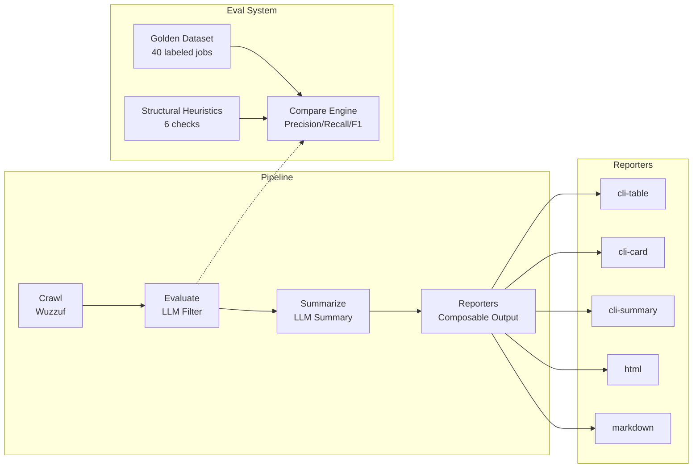

# Job Searches — AI-powered job filtering with local LLMs

Crawls job listings from Wuzzuf, filters them through a local LLM (Ollama) with structured JSON output, and generates markdown reports in your terminal.

## Quick Start

**Prerequisites:**
- Node.js 18+
- pnpm
- [Ollama](https://ollama.com) running locally with at least one model pulled (check [`src/config.ts`](src/config.ts) for currently configured models)

**Install & Run:**

```bash
pnpm install
pnpm start          # crawl → evaluate → summarize → display
```

## Architecture



## Pipeline

| Stage | Description |
|-------|-------------|
| **Crawl** | Cheerio crawler fetches jobs from 4 Wuzzuf search URLs (max 20 requests) |
| **Evaluate** | Sends jobs to Ollama LLM with filter prompt → parses structured JSON with Zod |
| **Summarize** | LLM-generated summary for passing jobs |
| **Reporters** | Composable output — render to terminal tables, cards, summary, HTML, or markdown files |

See [`src/pipeline/README.md`](src/pipeline/README.md) for pipeline details and [`src/reporters/README.md`](src/reporters/README.md) for reporter details.

## Evaluation System

- **Golden dataset**: 40 hand-labeled jobs (12 PASS, 27 FAIL, 1 POTENTIAL_MATCH) compared against LLM output
- **Metrics**: Precision, recall, F1 per class — primary metric is PASS F1 (minority class)
- **Structural heuristics**: 6 checks catch dropped jobs, invalid statuses, empty reasons, etc.
- **Threshold**: 80% accuracy target

See [`src/evals/README.md`](src/evals/README.md) for details.

## Configuration

Models are configured in [`src/config.ts`](src/config.ts). Check that file for the current list of available model keys.

**To add a new model:**

1. Pull the model in Ollama: `ollama pull <model-tag>`
2. Add an entry to `modelConfigs` in `src/config.ts`:

```ts
const modelConfigs = {
  myModel: { model: 'ollama-model-tag', temperature: 0.2, think: false },
  // ...existing configs
} as const satisfies Record<string, ModelConfig>;
```

3. Use the key (`myModel`) with `pnpm eval myModel` or `pnpm compare` (which benchmarks all configured models).

**Reporters** are configured separately in the `shared` object in [`src/config.ts`](src/config.ts):

```ts
export const shared = {
  reporters: ['cli-table'],  // change to e.g. ['html', 'cli-summary']
  // ...
};
```

**Available reporters:** `cli-table`, `cli-card`, `cli-summary`, `html`, `markdown`. Multiple reporters can be combined: `reporters: ["html", "cli-summary"]`.

## Scripts Reference

| Script | Command | Description |
|--------|---------|-------------|
| `pnpm start` | `tsx src/main.ts` | Full pipeline: crawl, evaluate, summarize, display |
| `pnpm eval <model>` | `tsx src/eval.ts` | Run golden dataset eval with a specific model |
| `pnpm compare` | `tsx src/compare-models.ts` | Benchmark all configured models, rank by PASS F1 |
| `pnpm preview-reporter <names...>` | `tsx src/reporters/preview.ts` | Preview reporters with sample data |
| `pnpm check` | `tsc --noEmit` | Type-check without emitting |

## Project Structure

```
src/
  main.ts              — Entry point, orchestrates the full pipeline
  config.ts            — Model configs (including reporter selection), shared settings
  eval.ts              — Single-model golden dataset evaluation
  compare-models.ts    — Multi-model benchmark comparison
  types/               — Shared TypeScript interfaces and Zod schemas
  pipeline/            — Crawl, evaluate, summarize stages + deterministic table helpers
  reporters/           — Composable output system (cli-table, cli-card, cli-summary, html, markdown)
  evals/               — Golden dataset engine, structural heuristics, report writer
  sites/wuzzuf/        — Wuzzuf site config, crawler, prompts, eval data
  helpers/             — Utility functions
eval-results/          — Generated eval/compare reports (gitignored)
reports/               — Generated HTML/markdown reports (gitignored)
storage/               — Crawlee internal state (gitignored, auto-generated)
```

## Adding a New Site

1. Create a new directory under `src/sites/<site-name>/`
2. Implement a crawler and define `BaseJob`-extending types
3. Write filter and report prompt templates with `{{placeholder}}` syntax
4. Export a `SiteConfig<T>` object from `index.ts`
5. Register it in `main.ts`

See [`src/sites/README.md`](src/sites/README.md) for a detailed guide.
