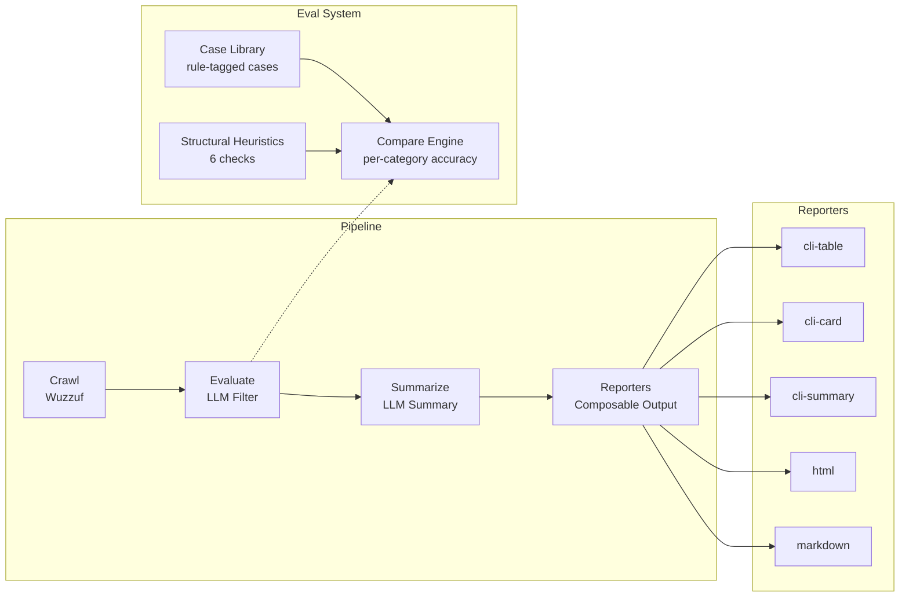

# Job Searches — AI-powered job filtering with local LLMs

Crawls job listings from Wuzzuf and Indeed Egypt, filters them through a local LLM (Ollama) with structured JSON output, and generates markdown reports in your terminal.

## Quick Start

**Prerequisites:**
- Node.js 18+
- pnpm
- [Ollama](https://ollama.com) running locally with at least one model pulled (check [`src/config.ts`](src/config.ts) for currently configured models)

**Install & Run:**

```bash
pnpm install
pnpm start wuzzuf        # crawl → evaluate → summarize → display (single site)
pnpm start indeed        # ...or any other single site
pnpm start all           # run every site, merge into ONE unified report
pnpm start wuzzuf,indeed # run a subset of sites, merged into one report

pnpm start wuzzuf --refresh  # IGNORE cached verdicts, re-evaluate ALL crawled jobs, and update the
                             # verdict cache (preserving firstSeenAt for known URLs). Run this after
                             # editing the filter prompt (src/pipeline/prompts/filter.md) so cached
                             # verdicts reflect the new rules.

pnpm start wuzzuf --only-new # Show ONLY jobs newly evaluated or dropped this run in the tables
                             # (cached jobs are hidden). Count boxes stay total. New jobs are 🆕-badged
                             # and sorted to the top regardless of this flag.

pnpm crawl wuzzuf        # CRAWL ONLY — dumps raw jobs to reports/, skips the LLM filter/summary/reporters.
                         # Use this when iterating on a crawler's extraction logic.
pnpm crawl wuzzuf --verbose  # same, but also prints the full JSON of the first 10 jobs per site.
```

**Available sites:** `wuzzuf`, `indeed`, `workable`, `jooble`, `linkedin`

## Architecture



## Pipeline

| Stage | Description |
|-------|-------------|
| **Crawl** | Cheerio/Playwright crawlers fetch jobs from job boards (each site: max 20 requests). Every crawled job is stamped with its origin `site` field. |
| **Evaluate** | Sends jobs to Ollama LLM with filter prompt → parses structured JSON with Zod. In a multi-site run (`pnpm start all`), this stage runs **once per site** (small per-site prompts) then the results are merged. |
| **Summarize** | One LLM-generated summary across **all** passing jobs from all sites (in a multi-site run) |
| **Reporters** | Composable output — render to terminal tables, cards, summary, HTML, or markdown files. Every report includes a `Site` column so each job shows its origin. |

**Single-site runs** (`pnpm start wuzzuf`) take an unchanged flat path. **Multi-site runs** (`all` or a comma-list) loop per site with skip-and-continue: if one site's crawl or filter call fails, the others still produce a unified report (with a "Skipped" note listing the failed site and reason). Output files are namespaced by site label: `reports/all-<timestamp>.html`, `reports/wuzzuf-indeed-<timestamp>.html`.

See [`src/pipeline/README.md`](src/pipeline/README.md) for pipeline details, [`src/reporters/README.md`](src/reporters/README.md) for reporter details, and [`src/sites/README.md`](src/sites/README.md) for site-specific implementation details.

### Verdict cache

Daily runs persist LLM filter verdicts (`jobURL → verdict`) to `state/verdict-cache.json`
(gitignored). On each run, jobs whose URL already has a stored verdict skip the LLM filter call
entirely — only genuinely-new postings are evaluated. This keeps daily runs fast and cheap:
a repeat posting costs zero filter tokens. `--refresh` forces a full re-evaluation (use after
changing the filter rules). The eval system is unaffected — it never reads or writes the cache.

New jobs are **marked** in the report: each job evaluated or dropped this run gets a 🆕 badge
and sorts to the top of its group, and the HTML report adds a "New" count box. `--only-new`
hides cached jobs from the tables so you see only today's discoveries (count boxes stay total),
and also scopes the LLM summary to just the newly-evaluated passing jobs. The first run
(cache empty) and `--refresh` badge every job, since all are newly evaluated.

## Evaluation System

- **Rule-tagged case library**: ~22 hand-labeled cases, ~80% sourced from **real crawled jobs** (`storage/datasets/*.json`), organized **one file per filter rule** under [`src/evals/cases/`](src/evals/cases/)
  - Categories: `title-seniority`, `internship`, `tech-stack`, `role-type`, `experience`, `location`, `ambiguous` (POTENTIAL_MATCH), `multi-cause` (compound failures)
  - Each case is **single-causal by construction** — it isolates exactly one filter rule (every other filter kept green), so per-category accuracy pinpoints which rules a model mishandles
  - Each entry is a `GoldenEntry` (non-generic) with a signal-descriptive `id` (e.g. `exp-threshold-4yr-fail`), a `category`, a `real` flag, the `job`, the `expectedStatus`, and an `isolationNote`
  - Scope a run with `--category <name>` (one rule) or `--cases id1,id2,...` (cherry-pick)
- **Metrics**: overall accuracy + **per-category accuracy**. No F1 / precision / recall. The model's `reason[]` text is kept in the output for inspection but is never keyword-matched or scored.
- **Structural heuristics**: 6 checks catch dropped jobs, invalid statuses, empty reasons, etc.
- **Threshold**: 80% overall accuracy target
- **Shared filter resources**: Evaluation uses the shared filter prompt ([`src/pipeline/prompts.ts`](src/pipeline/prompts.ts) → `src/pipeline/prompts/filter.md`) and the shared `jobEvaluationSchema` ([`src/types/evaluated-job.ts`](src/types/evaluated-job.ts)) — no per-site filter prompt or schema

See [`src/evals/README.md`](src/evals/README.md) for details.

## Configuration

Models are configured in [`src/config.ts`](src/config.ts). Check that file for the current list of available model keys.

**To add a new model:**

1. Pull the model in Ollama: `ollama pull <model-tag>`
2. Add an entry to `modelConfigs` in `src/config.ts`:

```ts
const modelConfigs = {
  myModel: { model: 'ollama-model-tag', temperature: 0.2, think: false, num_ctx: 40000 },
  // ...existing configs
} as const satisfies Record<string, ModelConfig>;
```

3. Use the key (`myModel`) with `pnpm eval myModel` or `pnpm compare` (which benchmarks all configured models).

**Reporters** are configured separately in the `shared` object in [`src/config.ts`](src/config.ts):

```ts
export const shared = {
  reporters: ['cli-table'],  // change to e.g. ['html', 'cli-summary']
  // ...
};
```

**Available reporters:** `cli-table`, `cli-card`, `cli-summary`, `html`, `markdown`. Multiple reporters can be combined: `reporters: ["html", "cli-summary"]`.

## Scripts Reference

| Script | Command | Description |
|--------|---------|-------------|
| `pnpm start <site>` | `tsx src/main.ts <site>` | Full pipeline for one site. Also accepts `all` (every site, unified report) or a comma-list like `wuzzuf,indeed`. |
| `pnpm crawl <site>` | `tsx src/crawl-dev.ts <site>` | **Crawl-only dev tool.** Runs ONLY the crawler and dumps raw jobs to `reports/crawl-<site>-<ts>.json`, skipping the LLM filter/summary/reporters. Accepts the same `all` / comma-list args as `pnpm start`. Add `--verbose` to print the full JSON of the first 10 jobs per site. Use when iterating on a crawler. |
| `pnpm eval <model>` | `tsx src/eval.ts` | Run the eval case library with a specific model. Add `--category <name>` to scope to one rule, or `--cases id1,id2` to cherry-pick. Exit 1 below 80% accuracy. |
| `pnpm compare` | `tsx src/compare-models.ts` | Benchmark all configured models, rank by overall accuracy. Accepts `--category` / `--cases`. |
| `pnpm compare-prompts <model>` | `tsx src/compare-prompts.ts` | Compare prompt variants for a model, rank by overall accuracy. Add `--variants v1,v2` and/or `--category` / `--cases`. |
| `pnpm preview-reporter <names...>` | `tsx src/reporters/preview.ts` | Preview reporters with sample data |
| `pnpm check` | `tsc --noEmit` | Type-check without emitting |

## Project Structure

```
src/
  main.ts              — Entry point, orchestrates the full pipeline
  config.ts            — Model configs (including reporter selection), shared settings
  eval.ts              — Single-model eval runner (--category / --cases scope)
  compare-models.ts    — Multi-model benchmark comparison
  compare-prompts.ts   — Prompt variant comparison runner
  types/               — Shared TypeScript interfaces and Zod schemas
  pipeline/            — Crawl, evaluate, summarize stages + deterministic table helpers
  reporters/           — Composable output system (cli-table, cli-card, cli-summary, html, markdown)
  evals/               — Rule-tagged case library (cases/), comparison engine, structural heuristics, report writer
  evals/cases/         — One file per filter rule (title-seniority, internship, tech-stack, role-type, experience, location, ambiguous, multi-cause)
  sites/wuzzuf/        — Wuzzuf site config, crawler, prompts
  helpers/             — Utility functions
  state/               — Persistent verdict cache (production pipeline)
eval-results/          — Generated eval/compare reports (gitignored)
reports/               — Generated HTML/markdown reports (gitignored)
state/                 — Verdict cache store (gitignored, auto-generated)
storage/               — Crawlee internal state (gitignored, auto-generated)
```

## Adding a New Site

1. Create a new directory under `src/sites/<site-name>/`
2. Implement a crawler and define a `BaseJob`-extending type
3. Export a `SiteConfig<T>` object from `index.ts` (no prompt files needed — both the filter and job-summary prompts are shared site-wide at `src/pipeline/prompts/`)
4. Register it in `main.ts`

See [`src/sites/README.md`](src/sites/README.md) for a detailed guide.
