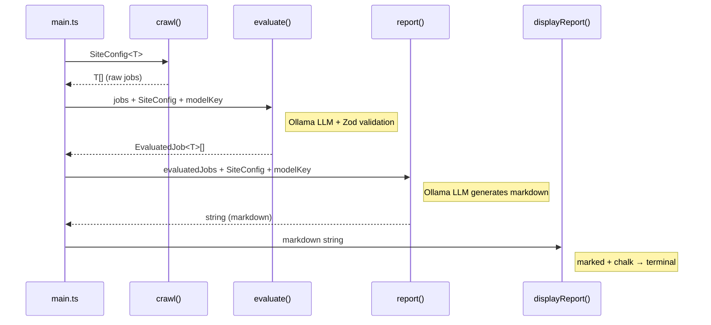

# Pipeline

The pipeline processes job listings through 4 sequential stages, each defined in its own file.

## Stages

### 1. `crawl.ts`

```ts
crawl<T extends BaseJob>(config: SiteConfig<T>): Promise<T[]>
```

Generic crawl orchestration using Crawlee CheerioCrawler. Delegates to the site's `crawl` function from `SiteConfig`. Returns raw job data.

### 2. `evaluate.ts`

```ts
evaluate<T extends BaseJob>(jobs: T[], config: SiteConfig<T>, modelKey: ModelConfigKey): Promise<EvaluatedJob<T>[]>
```

Sends jobs to Ollama LLM with the filter prompt, parses structured JSON response using Zod validation. Each job gets a status (`PASS`/`FAIL`/`POTENTIAL_MATCH`) and an array of reason strings. Uses `config.evaluationSchema` to validate the response and `config.prompts.filter` as the prompt template.

### 3. `report.ts`

```ts
generateReport<T extends BaseJob>(evaluatedJobs: EvaluatedJob<T>[], config: SiteConfig<T>, modelKey: ModelConfigKey): Promise<string>
```

Sends evaluated jobs to LLM with the report prompt, generates a human-readable markdown summary. Uses `config.prompts.report`.

### 4. `display.ts`

```ts
displayReport(markdown: string): void
```

Renders markdown to terminal using `marked` + `marked-terminal` + `chalk`. Has `@ts-ignore` on `marked.use(markedTerminal())` due to type mismatch (works at runtime).

## Pipeline Flow

```
crawl() → evaluate() → report() → displayReport()
   T[]    EvaluatedJob<T>[]    string      void
```



## Key Types

| Type | Source | Description |
|------|--------|-------------|
| `BaseJob` | `src/types/base.ts` | `{ jobTitle, jobURL, date, jobDetails }` |
| `EvaluatedJob<T>` | `src/types/evaluated-job.ts` | `{ job: T, status: JobStatus, reason: string[] }` |
| `SiteConfig<T>` | `src/types/site-config.ts` | Generic config with crawl fn, schemas, prompts |
| `ModelConfigKey` | `src/config.ts` | Keys of `modelConfigs` — check the file for current values |

## Adding a New Stage

1. Create a new file exporting an async function
2. Import and call it in `main.ts` in sequence
3. Each stage receives the output of the previous stage as input
