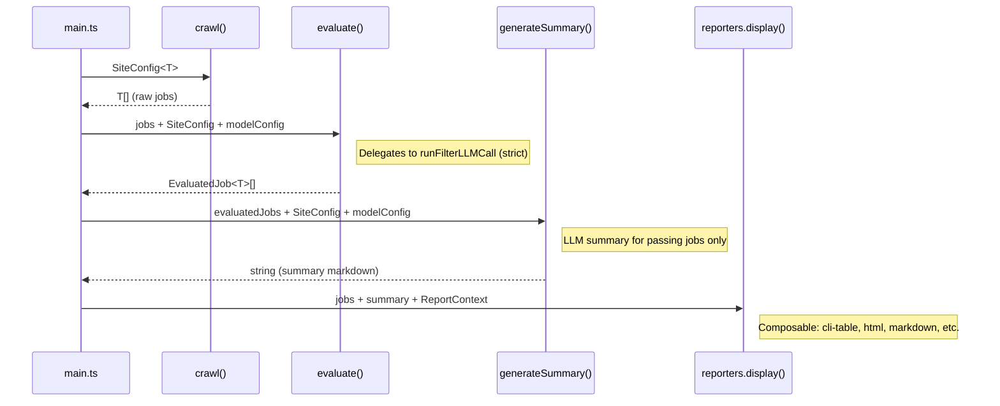

# Pipeline

The pipeline processes job listings through 4 sequential stages, each defined in its own file.

## Stages

### 1. `crawl.ts`

```ts
crawl<T extends BaseJob>(config: SiteConfig<T>): Promise<T[]>
```

Generic crawl orchestration using Crawlee CheerioCrawler. Delegates to the site's `crawl` function from `SiteConfig`. Returns raw job data.

### 2. `evaluate.ts`

```ts
evaluate<T extends BaseJob>(site: SiteConfig<T>, jobs: T[], modelConfig: ModelConfig): Promise<EvaluatedJob<T>[]>
```

Thin production wrapper around `runFilterLLMCall(jobs, modelConfig, { mode: "strict" })` (see `run-filter.ts` below). Adds structural-heuristics logging. Strict mode means any LLM misbehavior (unknown/duplicate/dropped URLs) throws immediately.

### 2a. `run-filter.ts` (shared filter pipeline)

Single source of truth for the LLM filter call. Used by `evaluate.ts` (production), `eval.ts`, and `compare-models.ts`. Exports:

| Export | Purpose |
|--------|---------|
| `parseLlmOutput(content)` | Strip ` ``` ` fences, JSON-parse, Zod-validate against `jobEvaluationSchema` |
| `logTimingAndTokens(response)` | Unified compact timing + token-usage log line |
| `mergeJobsByUrl(jobs, parsed, mode)` | Re-attach original jobs to LLM output via URL. `mode: 'strict'` throws on bad URLs; `'tolerant'` warns and continues |
| `runFilterLLMCall(jobs, modelConfig, { mode })` | Build prompt, call Ollama (with `keep_alive`), log timing, parse, merge. Returns `{ aiOutput, response }` |
| `runFilterEval(modelKey, goldenDataset)` | High-level: runs `runFilterLLMCall` on the supplied golden dataset in tolerant mode, then adds `compareGolden()` + heuristics. Returns `{ aiOutput, comparison, heuristics }`. The caller picks the dataset — combined via `getGoldenDataset()` or a single site via `getGoldenDataset('wuzzuf')` (the `--site` flag). Used by `eval.ts` and `compare-models.ts` |

### 3. `generate-summary.ts`

```ts
generateSummary<T extends BaseJob>(site: SiteConfig<T>, evaluatedJobs: EvaluatedJob<T>[], modelConfig: ModelConfig): Promise<string>
```

Generates an LLM summary for passing jobs only, using the `jobSummary` prompt template. Returns the raw markdown string (empty string if no passing jobs). Deterministic table generation is handled by reporters via `buildReportTables()`.

### 4. `report-helpers.ts`

Deterministic report utilities (no LLM calls):

- `parseRelativeDate(dateStr)` — Parses relative date strings (English + Arabic) into numeric days for sorting
- `splitByStatus(jobs)` — Splits evaluated jobs into passing (`PASS` + `POTENTIAL_MATCH`) and failing groups
- `sortByDate(jobs)` — Sorts jobs by date (newest first)
- `buildReportTables(jobs)` — Builds the passing/failing markdown tables + summary counts

## Pipeline Flow

```
crawl() → evaluate() → generateSummary() → reporters.display()
   T[]    EvaluatedJob<T>[]      string            void
```



## Key Types

| Type | Source | Description |
|------|--------|-------------|
| `BaseJob` | `src/types/base.ts` | `{ jobTitle, jobURL, company, location, date, jobDetails[] }` |
| `EvaluatedJob<T>` | `src/types/evaluated-job.ts` | `{ job: T, status: JobStatus, reason: string[] }` |
| `SiteConfig<T>` | `src/types/site-config.ts` | Generic config with crawl fn, schemas, prompts |
| `ModelConfigKey` | `src/config.ts` | Keys of `modelConfigs` — check the file for current values |

## Adding a New Stage

1. Create a new file exporting an async function
2. Import and call it in `main.ts` in sequence
3. Each stage receives the output of the previous stage as input
